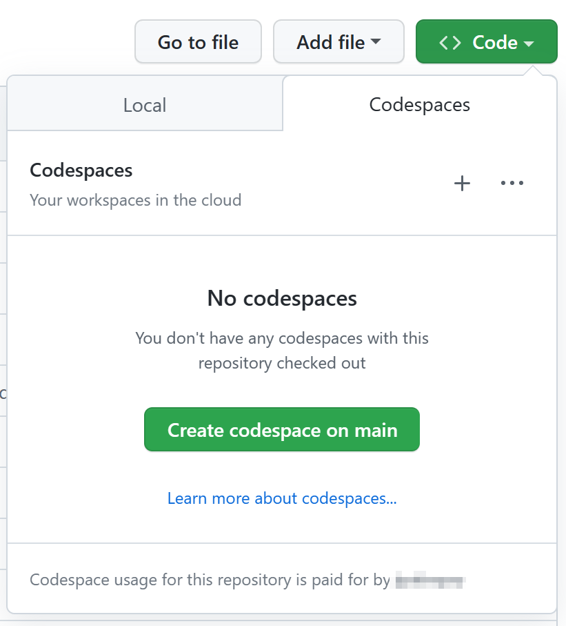
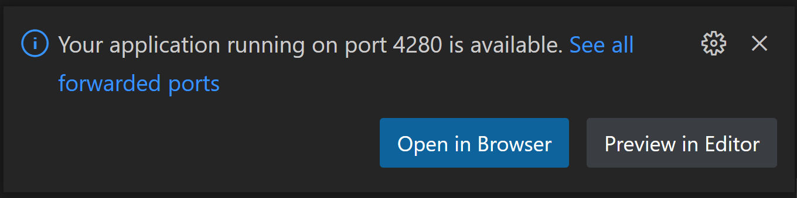
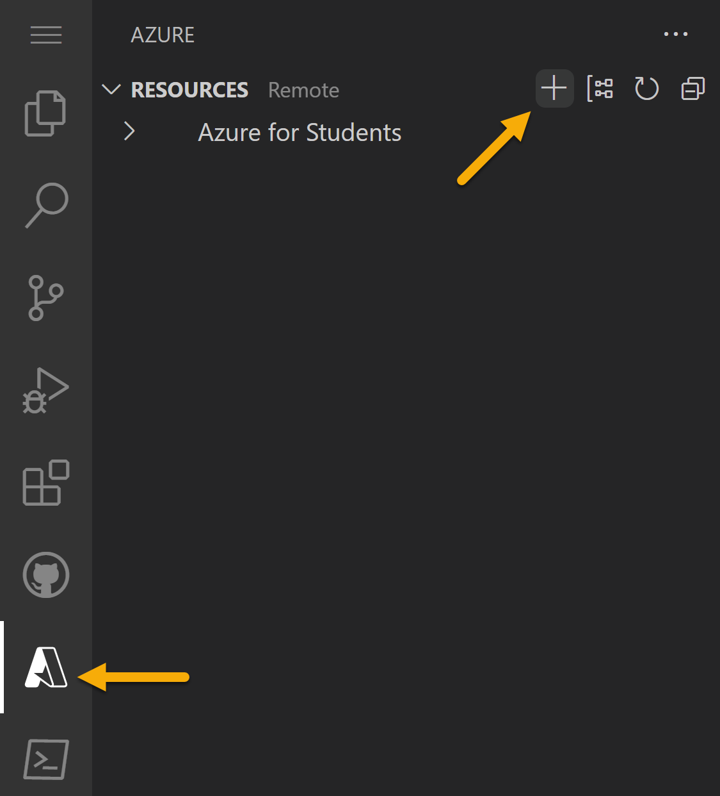
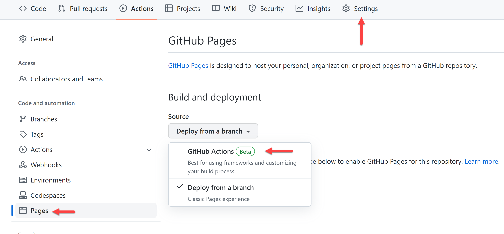
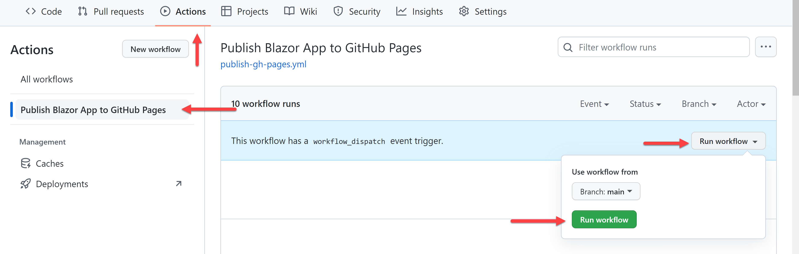
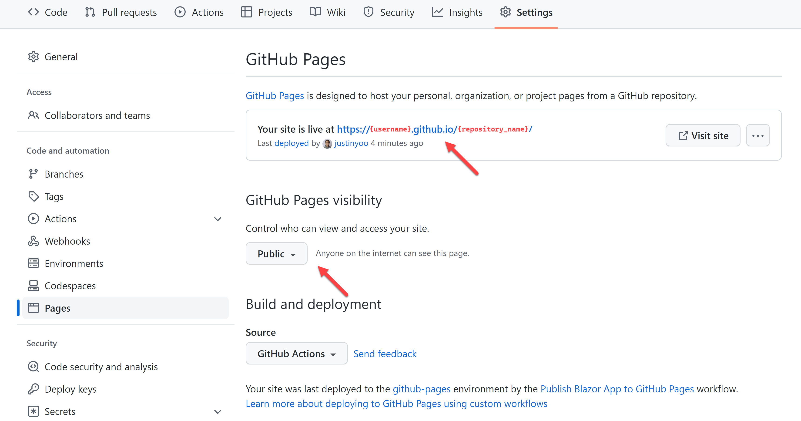
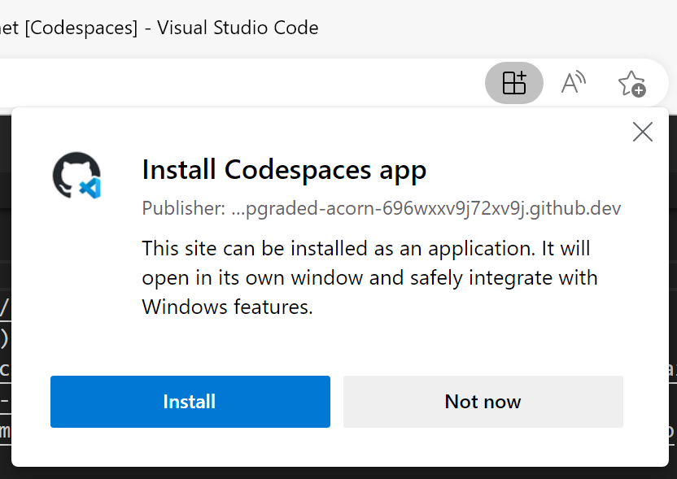

[](https://github.com/codespaces/new?hide_repo_select=true&ref=main&repo=education/codespaces-project-template-dotnet) 

# GitHub Codespaces로 .NET Blazor 포트폴리오 사이트 만들기

_단 몇 분 만에 개인 포트폴리오 웹사이트를 만들고 수정해서 배포해 보세요._ ✨

이 템플릿 리포지토리는 곧바로 사용할 수 있는 기본 코드 세트와 개발 환경을 갖추고 있습니다. 따라서 별다른 설정 없이도 곧바로 Codespaces를 실행해 웹사이트 코드를 수정할 수 있습니다.

- **누가 이 리포지토리를 쓸 수 있나요?** __누구든 사용할 수 있습니다__. 포트폴리오 사이트를 만들고 싶은 __누구나__, 웹 개발을 배우고 싶은 __누구나__, Codespaces를 테스트해 보고 싶은 __누구나__ 쓸 수 있습니다.
- **경력이 필요한가요?** __필요 없습니다__. 경험이 있으면 있는대로 없으면 없는대로, 시간이 있으면 있는대로 없으면 없는대로 원하는 만큼 수정해서 쓰면 됩니다.
- **개발 도구가 필요한가요?** _필요 없습니다_. 아무것도 설치할 필요가 없습니다. 웹 브라우저만 있으면 됩니다.
- **전제 조건이 있나요?** _없습니다_. 이 템플릿은 자신의 포트폴리오 웹사이트를 제작해서 배포할 때 까지 필요한 모든 개발 환경을 준비해 뒀습니다.

## 이 포트폴리오 템플릿은 ...

이 "choose your own adventure" 포트폴리오 템플릿에는 [Blazor](https://dotnet.microsoft.com/apps/aspnet/web-apps/blazor?WT.mc_id=dotnet-82024-juyoo) 기반의 웹 애플리케이션이 들어있어, 웹 브라우저만을 이용해 쉽게 수정하고 배포할 수 있습니다.


### 빠르게 시작하기

1. **Use this Template** 버튼을 클릭합니다. <br> [](https://github.com/education/codespaces-project-template-dotnet/generate)
1. 리포지토리 소유자를 선택합니다. (예시: 자신의 GitHub 계정)
1. 새 리포지토리의 이름을 입력합니다.
1. **Code** 버튼을 클릭합니다.
1. **Create Codespace on main** 버튼을 클릭합니다.
1. [포트폴리오 사이트를 수정합니다](#-customize-your-site-in-4-steps).
1. [포트폴리오 사이트를 배포합니다](#-deploy-your-web-application).

<details>
   <summary><b>🎥 Codespaces에 대해 자세히 알아보고 싶다면 아래 비디오 튜토리얼을 시청해 보세요.</b></summary>

   [](https://aka.ms/CodespacesVideoTutorial "Codespaces Tutorial")
</details>


<br />

## 🗃️ .NET Blazor 포트폴리오 템플릿

이 리포지토리는 Blazor WebAssembly 프레임워크를 사용하여 .NET 기반의 개인 포트폴리오용 프론트엔드 웹 애플리케이션을 만들기 위한 GitHub 템플릿 리포지토리입니다. Codespaces를 통해 개인 웹사이트를 만드는 데 있어서 곧바로 활용할 수 있는 템플릿을 제공하고자 함입니다.

이 리포지토리는 아래와 같은 내용을 포함합니다 :

- `/.devcontainer`
  - `.devcontainer/Dockerfile`: Codespaces가 사용하는 컨테이너 구성 파일로, 운영 체제 및 기타 세부 정보를 담고 있음
  - `.devcontainer/devcontainer.json`: Codespaces가 사용하는 Visual Studio Code 환경 설정을 위한 파일로, 추가 익스텐션 정보 등을 담고 있음
  - `.devcontainer/on-create.sh`: Codespaces가 사용하는 추가적인 스크립트 파일로, 파워셸과 같은 추가적인 도구 설치 정보를 담고 있음
- `/src`: 포트폴리오 사이트를 구축하기 위한 Blazor WebAssembly 프로젝트
- `.editorconfig`: Codespaces에서 일관성 있는 코딩 스타일을 유지하는 데 유용한 [EditorConfig](https://editorconfig.org/) 설정 파일
- `global.json`: Blazor WebAssembly 프로젝트에서 .NET의 프리뷰 버전 대신 정식 버전만 사용할 수 있도록 설정하는 파일
- `swa-cli.config.json`: Codespaces에서 Blazor WebAssembly 앱을 [Azure SWA CLI](https://azure.github.io/static-web-apps-cli/)로 실행할 때 사용하는 설정 파일
- `MyPortfolio.sln`: Blazor WebAssembly 애플리케이션 프로젝트를 포함한 솔루션 파일

<br />

## 🚀 시작하기

이 포트폴리오 사이트 프로젝트는 샘플 데이터가 이미 있어, 바로 Codespaces를 열어 웹 앱을 실행시킬 수 있는지 확인하고, 언제든 배포 가능합니다.

시작할 때 필요한 개발 환경을 모두 마련해 두었습니다 [.NET Codespaces 템플릿](https://github.com/education/codespaces-teaching-template-dotnet)을 기반으로 이미 사용할 수 있는 항목:

- 포트폴리오 사이트의 각 섹션에 대한 구성 요소를 포함한 간단한 [Blazor WebAssembly](https://dotnet.microsoft.com/apps/aspnet/web-apps/blazor?WT.mc_id=dotnet-82024-juyoo) 애플리케이션
- 배포 시 사이트를 구축하기 위한 [SWA CLI](https://azure.github.io/static-web-apps-cli/)
- 코드 일관성을 위해 [EditorConfig](https://editorconfig.org/)를 사용한 코드 린팅 및 형식 지정

### 개인 포트폴리오 생성하기


1. 이 템플릿에서 리포지토리를 만듭니다. 이 [리포지토리 생성하기](https://github.com/education/codespaces-teaching-template-dotnet/generate)를 사용합니다. 리포지토리 소유자를 선택하고 원하는 경우 이름과 설명을 작성합니다. 새 리포지토리를 공개 또는 비공개로 지정합니다.
1. 새로 생성한 리포지토리의 메인 페이지로 이동합니다.
1. 리포지토리 이름 아래에 있는 코드 드롭다운 메뉴를 클릭하고 Codespaces 탭에서 "Create codespace on main"을 클릭합니다.

    

1. GitHub에서 Codespaces의 초기화 과정을 기다립니다.

    

1. 초기화가 끝나면 하단에 터미널 섹션과 함께 Codespaces가 나타납니다. 여기서 `dotnet restore && dotnet build` 명령어를 실행 중인 것이 보입니다. 실행이 끝나면 `swa start` 명령어를 통해 웹 애플리케이션을 실행할 수 있는 터미널 프롬프트로 돌아갑니다.

   웹 애플리케이션을 실행하면 **Your application running on port 4280 is available.**라는 메시지가 나타나고 브라우저 내에서 해당 사이트를 열 수 있습니다. 

   

<br />

## ✨ 네 단계에 걸쳐 사이트 수정하기

이 프로젝트는 원하는 대로 쉽게 수정할 수 있습니다. 사이트의 각 섹션은 별도의 컴포넌트이며, 사용자의 정보는 한 곳에만 저장해야 합니다. 이렇게 함으로써 업데이트를 쉽게 할 수 있고, 어떤 방식으로 Blazor 컴포넌트에 값을 전달하는지 확인할 수 있습니다.
  
각 단계별로 Codespaces에서 프로젝트를 연 다음 내용을 변경하고 변경 사항을 커밋할 수 있습니다.

> 자세한 Codespaces 소스 코드 제어 방법은 [Codespaces에서 소스 코드 제어 사용하기](https://docs.github.com/codespaces/developing-in-codespaces/using-source-control-in-your-codespace)를 참조하세요.

### 1️⃣ 세부 정보 및 소셜 미디어 계정 추가하기

 `/src/BlazorApp/wwwroot/sample-data/siteproperties.json` 파일을 열고 JSON 개체에서 필요한 키와 그 키에 해당하는 값을 수정합니다. 이름, 제목, 이메일 및 소셜 미디어 계정을 사용자가 원하는 대로 수정하세요.  

```jsonc
{
  "name": "Alexandrie Grenier",
  "title": "Web Designer & Content Creator",
  "email": "alex@example.com",
  "gitHub": "microsoft",
  "devDotTo": null,
  "instagram": "microsoft",
  "linkedIn": "satyanadella",
  "medium": "",
  "twitter": "microsoft",
  "youTube": "microsoft",
};
```

사이트 상단에 보이는 이름과 제목을 원하는 대로 수정하세요.

이메일 주소와 소셜 계정 입력은 _선택 사항_ 이고, `Footer` 컴포넌트에 쓰입니다. 이들을 작성하지 않거나 빈 문자열("")로 설정하면 해당 아이콘과 링크가 나타나지지 않습니다.

### 2️⃣ 이미지 변경하기

이 포트폴리오 사이트에는 세 가지 이미지가 있습니다: 상단 섹션 배경, "About me" 섹션 배경, 포트폴리오 섹션(책상 사진). 이 기본 세 가지 이미지들 대신 저작권 문제 없이 자유롭게 사용할 수 있는 이미지나 자신이 소유하고 있는 이미지 중 **가로 형태**의 이미지를 넣으면 됩니다.

[Pixabay](https://pixabay.com/) 또는 [Unsplash](https://unsplash.com) 같은 사이트에서 사진을 찾을 수 있습니다. 사진, 일러스트, 벡터 이미지 등 원하는 이미지를 찾으면 각각을 `/src/BlazorApp/wwwroot/images` 에 간결하고 의미 있는 파일명으로 저장합니다.

`/src/BlazorApp/wwwroot/sample-data/heroimages.json` 을 열어 각 이미지의 `alt` 텍스트를 수정하세요:

```jsonc
[
  {
    // Home component
    // section at top of the page, main image you will see when site loads (woman standing by server wall in sample)
    "name": "home",
    "src": "images/server-wall.jpg",
    "alt": "woman holding laptop standing by server room with glass wall"
  },
  {
    // About me component
    // background behind the detailed "about me" section (abstract mosaic in sample)
    "name": "about",
    "src": "images/mosaic.svg",
    "alt": "purple and blue abstract background"
  },
  {
    // Portfolio component
    // image highted in left hand side of section (design desk photo in sample)
    "name": "portfolio",
    "src": "images/design-desk.jpeg",
    "alt": "desktop with books and laptop"
  }
]
```

### 3️⃣ "about me" 추가하기

"about me" 섹션은 사람들에게 여러분의 기술과 관심사에 대한 정보를 제공하기 좋습니다. `/src/BlazorApp/wwwroot/sample-data/aboutme.json` 을 열고 다음 세 가지 속성을 수정하세요: 

- `description`: 자신, 직업 목표 및 관심사에 대한 짧은 하나 또는 두 문장
- `skillsList`: 사이트에 나열할 기술 [목록](https://developer.mozilla.org/docs/Web/JavaScript/Reference/Global_Objects/Array)은 원하는 만큼 작성
- `detailOrQuote`: 자신과 관련한 더 많은 세부 정보를 추가하거나 좋아하는 명언을 넣을 수 있는 긴 블록

### 4️⃣ 작업한 프로젝트를 추가하고 세부 텍스트 입력하기

이 섹션은 여러분이 작업한 프로젝트를 강조하는 포트폴리오입니다. 기사, 비디오, 로고 디자인, GitHub 프로젝트 등 자신을 부각하는 내용으로 구성할 수 있습니다!

`/src/BlazorApp/wwwroot/sample-data/projects.json` 파일 내 JSON 배열의 항목에는 **제목, 설명, URL** 이 필요합니다.

예시 내용에는 네 개의 항목만 있지만, 항목 수는 자유롭게 선택하면 됩니다.

```jsonc
[
  {
    "title": "10 Things To Know About Azure Static Web Apps 🎉",
    "description": "Collaboration to create a beginner friendly article to help explain Azure Static Web Apps and tooling to get started.",
    "url": "https://dev.to/azure/10-things-to-know-about-azure-static-web-apps-3n4i"
  },
  {
    "title": "Web Development for Beginners",
    "description": "Contributed sketch note imagery to accompany each lesson. These help provide visual representation of what is being taught.",
    "url": "https://github.com/microsoft/web-dev-for-beginners"
  },
  {
    "title": "My Resume Site",
    "description": "Created from Microsoft's resume workshop and deployed to GitHub pages. Includes my experience and design abilities.",
    "url": "https://github.com/microsoft/workshop-library/tree/main/full/build-resume-website"
  },
  {
    "title": "GitHub Codespaces and github.dev",
    "description": "Video interview to explain when to use GitHub.dev versus GitHub Codespaces, and how best to use each tool.",
    "url": "https://www.youtube.com/watch?v=c3hHhRME_XI"
  }
]
```

<br/>

## 🏃 웹 애플리케이션 배포하기

이 프로젝트는 **무료**로 [Azure 정적 웹앱](https://azure.microsoft.com/products/app-service/static/?WT.mc_id=dotnet-82024-juyoo) 및 [GitHub Pages](https://pages.github.com/)</a>에 배포할 수 있습니다.

### Azure 정적 웹앱

[Azure 정적 웹앱](https://azure.microsoft.com/products/app-service/static/?WT.mc_id=dotnet-82024-juyoo)은 Microsoft의 정적 사이트(또는 서버가 아닌 사용자의 브라우저에서 직접 보이는 사이트)를 위한 호스팅 솔루션입니다. 이 서비스는 Azure Functions, 인증, 스테이징 버전 등 Azure를 통해 사이트를 확장할 수 있습니다.

웹 애플리케이션을 배포하려면 Azure 계정과 GitHub 계정이 모두 필요합니다. Azure 계정이 아직 없다면, 배포 과정 중에 생성하거나 아래 링크에서 생성하세요 :

- [학생용 Azure 계정 만들기(신용 카드 필요 없음)](https://azure.microsoft.com/free/students/?WT.mc_id=dotnet-82024-juyoo)
- [새로운 Azure 계정 만들기](https://azure.microsoft.com/free/?WT.mc_id=dotnet-82024-juyoo)

1. Codespaces에서 프로젝트를 엽니다.  
1. 왼쪽 사이드바의 Azure 아이콘을 클릭합니다. 아직 로그인하지 않았다면 로그인하고, Azure를 처음 사용하는 경우 안내에 따라 계정을 만듭니다.
1. Azure 메뉴에서 "➕" 기호를 누른 다음 "Create Static Web App"을 선택합니다.

   

1. GitHub에 로그인하지 않은 경우 로그인하라는 안내가 나타납니다. 아직 변경 사항을 커밋하지 않았을 경우, 커밋 요청 메시지가 보입니다.
1. 애플리케이션 정보를 입력할 때:
    1. **Name for Static Web App**: 정적 웹앱의 이름을 입력합니다. 기본값은 GitHub 리포지토리 이름입니다.
    1. **Region**: 여러분의 지역에서 가장 가까운 곳을 고릅니다.
    1. **Project structure**: "Blazor"를 선택합니다.
    1. **Location of application code**: `/src/BlazorApp` 을 입력합니다.
    1. **Output location**: `wwwroot` 를 입력합니다.
1. 입력이 끝나면 화면 하단에 알림이 나타나고, 새로운 GitHub Action 워크플로 파일이 프로젝트에 만들어집니다. "Open Action in GitHub"을 클릭하면 방금 만들어진 작업이 보이고, 현재 실행 중인 것을 확인할 수 있습니다.

> 🤩 **보너스** : [Azure 정적 웹앱에 사용자가 원하는 도메인을 추가하기](https://learn.microsoft.com/shows/azure-tips-and-tricks-static-web-apps/how-to-set-up-a-custom-domain-name-in-azure-static-web-apps-10-of-16--azure-tips-and-tricks-static-w/?WT.mc_id=dotnet-82024-juyoo)

### GitHub Pages

[GitHub Pages](https://pages.github.com/)를 사용하면 GitHub 리포지토리에서 웹사이트를 직접 호스팅할 수 있습니다. 이 프로젝트의 포트폴리오 앱을 GitHub Pages에 간편하게 배포해 보세요.  
  
GitHub 리포지토리에서:  

1. "Settings" 탭으로 이동하고 "Pages" 메뉴로 이동합니다.
1. _Build and deployment_ 부분에서, source를 **GitHub Actions**으로 선택합니다.

    

1. GitHub Pages의 visibility를 **Public**으로 설정합니다.
1. 코드를 푸시하거나 수동으로 호출하여 GitHub Action 워크플로를 실행합니다.

    

1. GitHub Pages에 접속합니다.

    

> 🤩 **보너스**: [GitHub Pages에 사용자가 원하는 도메인을 추가하기](https://docs.github.com/pages/configuring-a-custom-domain-for-your-github-pages-site/managing-a-custom-domain-for-your-github-pages-site)

<br />


## 🏆 도전과제

추가적으로 아래 네 가지 방법을 통해 포트폴리오 사이트를 수정하고 Codespaces, CSS, HTML 및 JavaScript를 익힐 수 있습니다.

  1. [Codespaces 작업 환경 설정하기](#1-customize-your-codespaces)
  1. [섹션 이동에 부드러운 스크롤 효과 적용하기](#2-update-to-smooth-scroll-to-a-section)
  1. [책상 사진에 애니메이션 추가하기](#3-animate-desk-photo)
  1. [새로운 섹션 추가하기](#4-add-a-new-section)

### 1. Codespaces 작업 환경 설정하기

`.devcontainer/devcontainer.json`에는 Codespaces 환경 구성에 필요한 확장 프로그램 정보가 담겨 있습니다. Codespaces를 시작할 때 원하는 확장 프로그램을 추가하거나 변경할 수 있습니다. 아래 과정에 따라 진행하세요:

1. 파일 `.devcontainer/devcontainer.json` 을 열고 **extensions** 속성을 찾습니다.

    ```jsonc
    "extensions": [
      "GitHub.copilot",
      "GitHub.copilot-chat",
      "ms-dotnettools.csdevkit",
      "ms-vscode.PowerShell",
      "ms-vscode.vscode-node-azure-pack",
      "VisualStudioExptTeam.vscodeintellicode"
    ]
    ```

1. **extensions** 항목으로 이동하여 `indent-rainbow` 확장 프로그램을 추가하세요:

    ```jsonc
    "oderwat.indent-rainbow"
    ```
  
   위와 같은 방식으로 [indent-rainbow](https://marketplace.visualstudio.com/items?itemName=oderwat.indent-rainbow&WT.mc_id=dotnet-82024-juyoo)의 고유 식별자를 추가했습니다. Codespaces 초기화 과정에서 자동으로 이 확장 프로그램을 설치할 것입니다.

확장 프로그램의 고유 식별자를 찾아 보세요:

- 이 링크를 통해 확장 프로그램의 웹 페이지로 이동합니다.  [https://marketplace.visualstudio.com/items?itemName=oderwat.indent-rainbow](https://marketplace.visualstudio.com/items?itemName=oderwat.indent-rainbow&WT.mc_id=dotnet-82024-juyoo)
- 오른쪽의 **More info** 섹션 아래에 고유 식별자 필드를 배치합니다.

> 💡 이와 관련한 더 많은 정보가 필요하다면, 여기를 참조하세요.
> <https://docs.github.com/codespaces/customizing-your-codespace/personalizing-github-codespaces-for-your-account>


### 2. 섹션 이동에 부드러운 스크롤 효과 적용하기

포트폴리오 사이트 헤더에는 아래 섹션으로 이동하는 링크가 있습니다. 이 링크를 클릭하면 해당 섹션으로 페이지가 스크롤해서 이동합니다. 하지만, 부드럽게 이동하는 것 같진 않죠?

스크롤 속도 조절을 통해 사용자 경험을 향상시켜 봅시다. 그렇게 함으로써 사용자는 페이지에서 무슨 일이 일어나고 있는지 또는 페이지의 어느 부분으로 이동하고 있는지 알 수 있습니다.

1. `/src/BlazorApp/wwwroot/css/app.css`를 엽니다. 이 파일은 포트폴리오 애플리케이션을 위한 스타일시트입니다. `html` 태그에 대한 스타일을 추가합시다. 코드를 보면 현재 `html`과 `body` 스타일을 함께 설정한 것이 보입니다. 따라서 `html`요소의 스크롤하는 방식을 설정하기 위해 아래 CSS 스니펫을 추가하세요:

    ```css
    html {
      scroll-behavior: smooth;
    }
    ```

포트폴리오 사이트가 Codespaces에서 실행 중입니다. 덕분에 포트폴리오 사이트에 변경 사항이 생길 때마다 이를 자동으로 반영합니다. 상단 헤더의 링크를 클릭해서 부드러운 스크롤 효과를 확인하세요.


### 3. 책상 사진에 애니메이션 추가하기
  
애니메이션으로 페이지 요소를 움직여서 사용자 상호작용을 높이고 특정 항목을 강조할 수 있습니다. 포트폴리오 섹션의 책상 사진에 애니메이션을 추가하세요.

1. 포트폴리오 사이트의 스타일시트인 `/src/BlazorApp/wwwroot/css/app.css`를 Codespaces 내에서 엽니다. 그리고 `@keyframes` 정의를 추가해서 왼쪽에서 슬라이드하는 애니메이션 시퀀스를 추가하세요:

    ```css
    @keyframes slideInLeft {
      0% {
        transform: translateX(-100%);
      }
      100% {
        transform: translateX(0);
      }
    }
    ```

1. 이제 `slideInLeft` 애니메이션 시퀀스를 정의했으므로, 책상 사진이 시퀀스대로 동작하게끔 합니다. `/src/BlazorApp/Components/Portfolio.razor`를 열고 `img` 태그를 찾습니다. 이 태그를 꾸미기 위해 인라인 CSS를 사용합니다. 스타일 정의 내에 다음을 추가하세요:

    ```css
    animation: 1s ease-out 0s 1 slideInLeft;
    ```

    이미지 태그는 아래와 같아야 합니다:

    ```html
    
    ```

포트폴리오 사이트가 Codespaces에서 실행 중입니다. 덕분에 포트폴리오 사이트에 변경 사항이 생길 때마다 이를 자동으로 반영합니다. 페이지를 위아래로 스크롤하여 책상 사진이 미끄러지듯 움직이는 것을 확인하세요.  

> 🤩 **추가 사항**: 스크롤 다운 화살표에 동작 추가하기


### 4. 새로운 섹션 추가하기

앞선 과정을 통해 기본으로 주어진 섹션만으로 포트폴리오 사이트를 만들었습니다. 더 담고 싶은 내용이 있다면 포트폴리오 사이트에 섹션을 추가해 보세요.

예를 들어서 포트폴리오 사이트에 교육 섹션을 추가하겠습니다.

1. `Components` 폴더 내에 새 섹션을 위한 새 컴포넌트를 생성합니다. `Education.razor`라는 새 파일을 추가합니다.

1. `Education.razor` 파일에 아래 내용을 추가하세요:

    ```razor
    <section class="light" id="portfolio">
        <h2>Education</h2>
    </section>
    ```

1. `Index.razor` 파일을 열고 페이지 내에서 보이길 원하는 위치에 Education 컴포넌트를 추가하세요:

    ```razor
    <Education />
    ```

포트폴리오 사이트가 Codespaces에서 실행 중입니다. 덕분에 포트폴리오 사이트에 변경 사항이 생길 때마다 이를 자동으로 반영합니다.

<br />


## 📚 참고 자료

- [GitHub Codespaces 문서 개요](https://docs.github.com/codespaces/overview)
- [GitHub Codespaces 가이드](https://docs.github.com/codespaces/guides)
- [VS Code와 Docker를 이용하여 로컬에서 dev containers 사용하기](https://github.com/microsoft/vscode-remote-try-dotnet#vs-code-dev-containers)
- [Blazor 시작하기](https://learn.microsoft.com/training/paths/build-web-apps-with-blazor/?WT.mc_id=dotnet-82024-juyoo)
- [초보자를 위한 웹 개발](https://github.com/microsoft/Web-Dev-For-Beginners)

> #### Codespaces 브라우저 앱
>
> Edge 또는 Chrome을 사용하는 경우, Codespaces를 시작할 때 Codespaces 앱을 설치할 수 있는 옵션이 나타납니다. Codespaces 앱을 사용하면, 브라우저 외부에서 작업할 수 있습니다. 앱 아이콘을 찾아보고 팝업 창으로 Codespaces 앱을 설치해 보세요.
>
> 

<br />

## 🔎 문제를 발견했거나 개선하기 원하는 내용이 있나요?

[GitHub Issue 열기](/../../issues/new)로 이 템플릿 리포지토리에 기여하세요!
